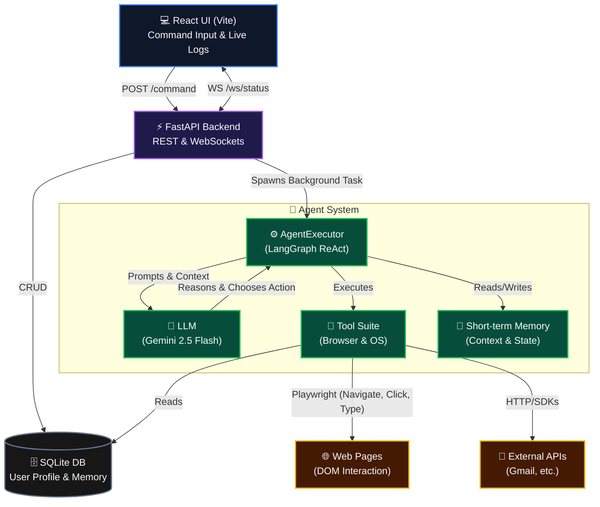

# Architecture Overview: Agentic AI Browser

This document outlines the high-level architecture of the Agentic AI Browser system, illustrating the flow of commands from the user interface down to external API integrations.

## System Architecture Diagram

## Component Details

### 1. React UI (`Vite`)
- **Role**: The control center for the user.
- **Responsibilities**: 
  - Captures natural language commands from the user.
  - Subscribes to real-time updates via WebSockets.
  - Visualizes the agent's step-by-step thought process, status, and progress.
  - Manages the user's persistent profile (Settings).

### 2. FastAPI Backend
- **Role**: The orchestration and communication bridge.
- **Responsibilities**:
  - Exposes REST endpoints (`POST /command`, `GET/POST /user/profile`).
  - Manages active WebSocket connections for live logging.
  - Offloads long-running agent tasks to `BackgroundTasks` to prevent blocking the event loop.
  - Interfaces with the SQLite database for basic CRUD operations.

### 3. Agent System (`LangGraph / LangChain`)
- **AgentExecutor**: The core loop that implements the ReAct (Reason + Act) prompting strategy. It manages the state machine of the task.
- **LLM**: Google's Gemini 2.5 Flash serves as the brain, parsing user intent, deciding which tool to use, and determining when a task is complete.
- **Tool Suite**: 
  - **Browser Tools**: Powered by Playwright to navigate URLs, click elements, and inject text.
  - **Memory Tools**: Tools capable of reading from the user profile database (e.g., retrieving the user's resume or address for auto-filling).
- **Memory**: Short-term conversation history and intermediate scratchpad used by the agent to retain context between steps.

### 4. External Integrations
- **Web Pages**: The actual DOM of external websites the agent interacts with via Chromium (Playwright).
- **External APIs**: Third-party services the agent might interact with directly without a browser (e.g., sending an email via SMTP/Gmail API if a tool is provided).
